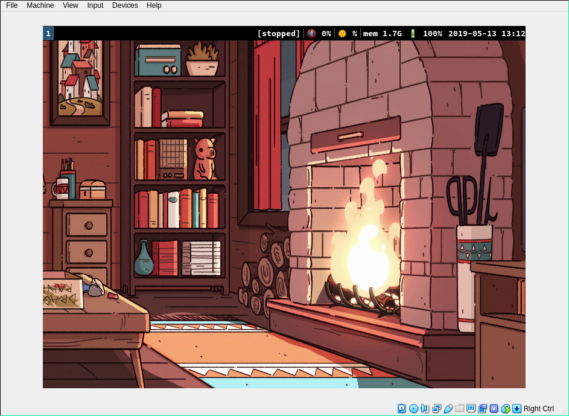

# Minimalist Arch Metadistribution

## Installation in VirtualBox

1. Download Arch ISO on [Arch Linux Downloads](https://www.archlinux.org/download)
2. Run it on VirtualBox
3. Run command below in LiveCD shell:
```bash
curl https://raw.githubusercontent.com/NickoEgor/metaarch/master/livecd.sh > livecd.sh && bash livecd.sh
```
4. Login as "root" user with "pass" password after reboot
5. Run command below:
```bash
curl https://raw.githubusercontent.com/NickoEgor/metaarch/master/rootsetup.sh > rootsetup.sh && bash rootsetup.sh && rm rootsetup.sh
```
6. Login as your new user and run:
```bash
bash ~/metaarch/graphicsetup.sh
```
7. Login again and the system is ready



## Basic movements

+ `super-t` — Terminal ([st](https://github.com/NickoEgor/st))
+ `super-b` — Browser ([QuteBrowser](https://github.com/qutebrowser/qutebrowser))
+ `super-p` — Power management
+ `super-m/super-shift-m` — Mount/unmount devices
+ `super-i` — Music player ([mpd](https://github.com/MusicPlayerDaemon/MPD) + [ncmpcpp](https://github.com/arybczak/ncmpcpp))
